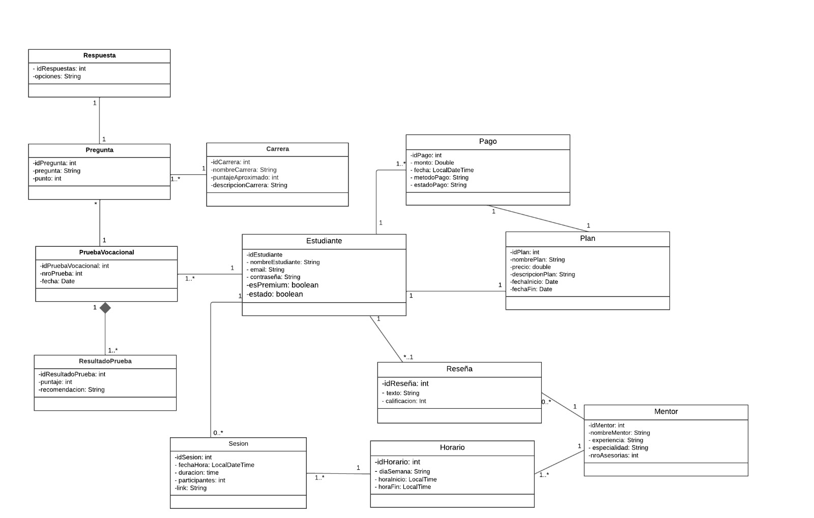
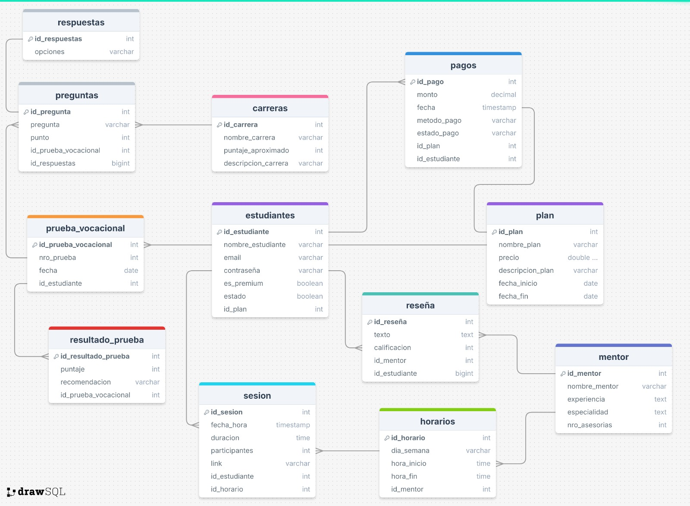

## Introducción

**TrueTest U** es una aplicación web diseñada para facilitar tanto a los estudiantes de cualquier etapa academica a solventar sus dudas por medio de un cuestionario, asi mismo los profesores pueden ofrecer su material de trabajo para orientar a los que esten interesados en la carrera pero con un costo que desbloqueara algunos de los materiales. Para estos mismos procesos se ve la opcion de pagos de diferentes entidades para la facilidad los alumnos(clientes), apartados donde estara su registro de pagos y carreras de interes e similares a los puestos. 

El proposito de **TrueTest U** es orientar de manera adecuada a los estudiantes que no tienen una idea clara de que carrera estudiar usando como medio una plataforma que sea accesible a todo publico y una gran cantidad de informacion dadá por los mismos profesores/profesionales con experiencia para asesoras a los mismos con un pago adicional.

### Colaboradores del Proyecto

| **Nombre**                          | **Rol**                           | **Perfil**                                                 |
|-------------------------------------|---------------------------        |----------------------------------------------------------|
| Oncoy Patricio Angelmauricio Rogger | Desarrallador de software         |[LinkedIn](https://www.linkedin.com/in/angel-oncoy-0843822a6/)|
| Dávila Ortiz Briyan Anthony         | Desarrallador de software         | [LinkedIn](https://www.linkedin.com/in/briyan-dávila-ortiz)         |
| Vidal Rodríguez Fabrizio            | Desarrallador de software         | [LinkedIn](https://www.linkedin.com/in/fabrizio-vidal-rodriguez-b8aa98328/)|
| Salirrosas Vasquez Jhordy           | Desarrallador de software         | [LinkedIn](https://www.linkedin.com/in/jhordy-salirrosas-30b52b259/)         |
| Rodriguez Lara Franklin Renato      | Desarrallador de software         | [LinkedIn](https://www.linkedin.com/in/franklin-renato-rodriguez-lara-a40a47329/)           |

### Revisa el Progreso del Proyecto TrueTest U

| **Columna**       | **Descripción**                                                                                                                                    |
|-------------------|----------------------------------------------------------------------------------------------------------------------------------------------------|
| **Backlog**       | Contiene todas las historias de usuario, tareas y características que deben desarrollarse. Es el listado de todo el trabajo pendiente.              |
| **En Progreso**   | Incluye las tareas que están actualmente en desarrollo. Visualiza el trabajo en curso para asegurar el flujo continuo de trabajo.                   |
| **Revisión**      | Después de completar una tarea, se mueve aquí para una revisión de código y revisión por pares (peer review). Esta fase incluye la creación de **pull requests** para asegurar que el código cumpla con los estándares de calidad antes de integrarse al proyecto principal. |
| **En Pruebas**    | Contiene las tareas que han pasado la revisión de código y necesitan pruebas exhaustivas (unitarias, de integración y de aceptación) para garantizar su calidad. |
| **Hecho**         | Las tareas completamente desarrolladas, revisadas y probadas se mueven aquí, indicando que están listas y finalizadas.                               |

Mira cómo va avanzando nuestro trabajo visitando el siguiente enlace: [Tablero de Trello](https://trello.com/b/pC5te4pD/grupo04-transa).

Mira el documento del proyecto visitando el siguiente enlace: [Documento del proyecto](https://docs.google.com/document/d/10hg4CEjcMu1VqGyGJj9XCIR-T0i68fGc0FdEgG6a0lQ/edit?pli=1).

### Funcionalidades de la Aplicación TestTrue U

#### **Módulo de Gestión de Usuarios:**

- **Creación de Estudiantes e Inicio de Sesión:**
    - Permitir a los Estudiantes registrarse en la plataforma.
    - Facilitar el inicio de sesión para acceder a la cuenta personal.
    - Mantener la seguridad de las credenciales de los usuarios.
    - Poder inhabilitar y eliminar la cuenta.
      
- **Informacion de la Sesión:**
    - Permitir a los Estudiantes editar informacion de su perfil creado.
    - Mostrar los resultados de la Evaluacion Vocacional.
    - Opcion de poder comparar las opciones de carreras.
      
#### **Módulo de Evaluación Vocacional:**

- **Evaluacion Vocacional funcional**
    - Realizar una Prueba Vocacional que muestre resultados de carreras.
    - Los de plan premium pueden tener la opcion de realizar nuevamente las pruebas.
    - Se pueda Visualizar 3 carreras como opcion.

#### **Módulo de Conexión con Expertos:**

- **Gestión de Expertos:**
    - Opcion de agendar sesiones con expertos con notificaciones.
    - Mostrar la informacion de los expertos para los Alumnos.
    - Permitir inicios de sesion de los orientadores ya seleccionados por la empresa.
      
- **Funciones para el perfil de Expertos:**
    - Buscar los expertos requeridos en el campo necesario segun los resultados.
    - Generar reseñas para los orientadores.

#### **Módulo de Recursos Educativos:**

- **Gestión de Informacion de las Carreras:**
    - Visualizar una descripcion detallada con videos e imganes.
    - Visualizar enlaces a articulos sobre el mercado laboral de la carrera.
    - Detalles con opciones de las especialidades de las Carreras.
    - Personalizar los recursos que se desea observar.
    - Poder guardar los recursos de las carreras para su revision despues.

#### **Módulo de Pagos en Línea: **

- **Gestion de pagos en Línea:**
    - Escoger entre diferentes planes de suscripcion.
    - Integracion con Paypal y otros metodos de pago.
    - Procesamiento de transacciones para el pago de la suspcripcion.
    - Desbloquear opciones y recursos al ser usuario Premium.
    - Registrar los pagos en un historial.

### Diagramas de la Aplicación

Para entender mejor la estructura y diseño de la aplicación "TrueTest-u", revisa los siguientes diagramas:

### Diagrama de Clases

### Diagrama de Base de Datos

Este diagrama ilustra el esquema de la base de datos utilizada por la aplicación, mostrando las tablas, columnas, y relaciones entre las entidades.

### Descripción de Capas del Proyecto

| capa            | descripción                                                                                                                     |
|-----------------|---------------------------------------------------------------------------------------------------------------------------------|
| api             | Contiene los controladores REST que manejan las solicitudes HTTP y las respuestas.                                              |
| entity          | Define las entidades del modelo de datos que se mapean a las tablas de la base de datos.                                        |
| repository      | Proporciona la interfaz para las operaciones CRUD y la interacción con la base de datos.                                        |
| service         | Declara la lógica de negocio y las operaciones que se realizarán sobre las entidades.                                           |
| service impl    | Implementa la lógica de negocio definida en los servicios, utilizando los repositorios necesarios.                              |
| config          | Contiene clases que manejaran la configuracion global de la aplicacion.                                                         |
| dto             | Define los Data Transfer Objects para transferir datos entre las capas de la aplicación sin exponer directamente las entidades. |
| infra.exception | Contiene las excepciones que ayudarán al momento de crear el sprint de seguridad.                                               |
| mapper          | Contiene las clases que se encargan de convertir las entidades a DTOs y viceversa para datos y la lógica de presentación.       |

# Asignación de Historias de Usuario

**Sprint 1:** Funcionalidades Básicas  
  *Enfocado en implementar las funcionalidades esenciales de CRUD para la gestión de Estudiantes, Mentores, asi mismo las funciones primordiales del test vocacional*

| Integrante                 | Módulo                       | Historia de Usuario                                       | Descripción                                                                                                                                      | Tipo  |
|----------------------------|------------------------------|-----------------------------------------------------------|--------------------------------------------------------------------------------------------------------------------------------------------------|-------|
| Oncoy Patricio, Angel      | Gestión de Estudiante        | Historia de Usuario 1: Registrar usuarios.                | Como administrador, quiero poder crear, leer, actualizar y eliminar categorías para mantener organizada la colección de libros.                   | CRUD  |
|                            | Gestión de Estudiante        | Historia de Usuario 2: Iniciar Sesion.                    | Como administrador, quiero poder crear, leer, actualizar y eliminar libros para mantener actualizada la oferta disponible en la plataforma.       | CRUD  |
| Vidal Rodriguez, Fabrizzio | Gestión de Prueba Vocacional | Historia de Usuario 3: Edicion de perfiles.               | Como usuario, quiero poder añadir libros a mi colección personal para organizar mis lecturas y favoritos en un solo lugar.                        | Core  |
|                            | Gestión de Estudiante        | Historia de Usuario 4: Historial de resultados de prueba. | Como usuario, quiero poder eliminar libros de mi colección personal cuando ya no los necesite o no desee tenerlos en mi lista.                    | Core  |
| Dávila Ortiz, Briyan       | Gestión de Estudiante        | Historia de Usuario 5: Inhabilitar cuenta.                | Como administrador, quiero poder crear, leer, actualizar y eliminar información de autores para mantener actualizada la base de datos de autores de libros. | CRUD  |
|                            | Gestión de Orientadores      | Historia de Usuario 20: CRUD de orientadores.             | Como administrador, quiero generar reportes de libros filtrados por categoría para obtener información sobre el catálogo disponible.              | CRUD  |
| Rodriguez Lara, Franklin   | Gestión de Prueba Vocacional | Historia de Usuario 9: Prueba de orientacion vocacional.  | Como usuario, quiero poder registrarme en la plataforma para acceder a las funcionalidades disponibles.                                           | CRUD  |
|                            | Gestión de Prueba Vocacional | Historia de Usuario 10: Resultado de las prueba.          | Como usuario, quiero poder actualizar mi información personal para mantener mis datos al día en la plataforma.                                    | CRUD  |
| Salirrosas Vasquez, Jhordy | Gestión de Orientadores      | Historia de Usuario 14: Visualizar la especialidad.       | Como usuario, quiero poder seleccionar libros para comprarlos, simulando el flujo de compra inicial antes de integrar los métodos de pago.       | Core  |
|                            | Gestión de Orientadores      | Historia de Usuario 15: Buscar expertos.                  | Como usuario, quiero generar un reporte de mi historial de compras para revisar las transacciones realizadas en la plataforma.                    | Core  |

